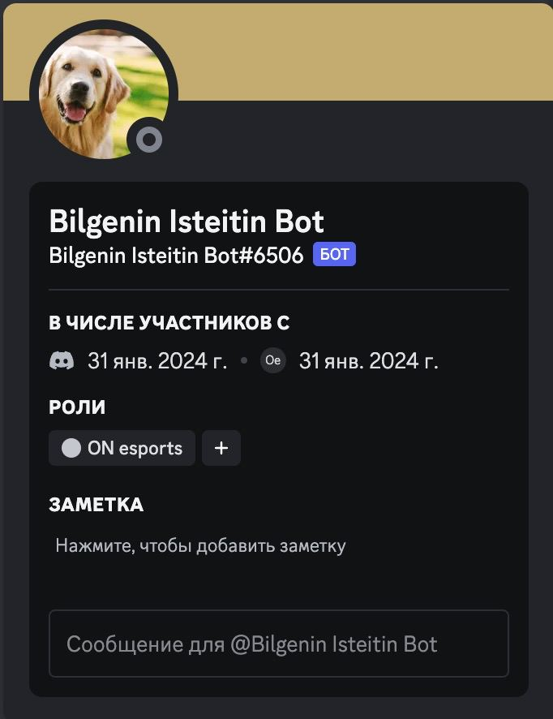
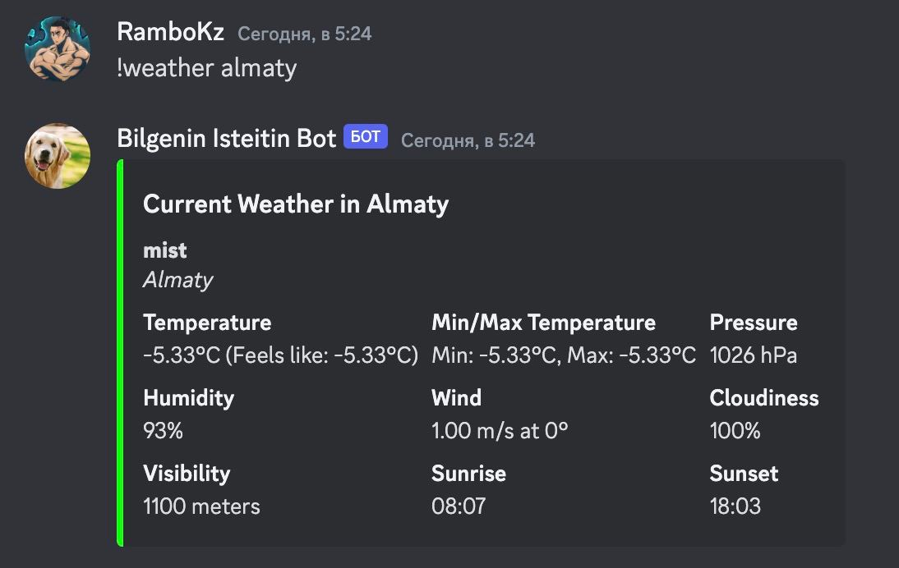
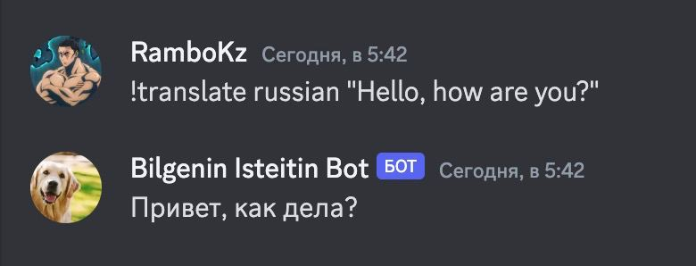
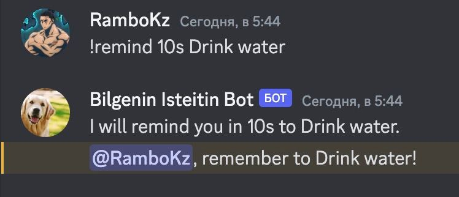
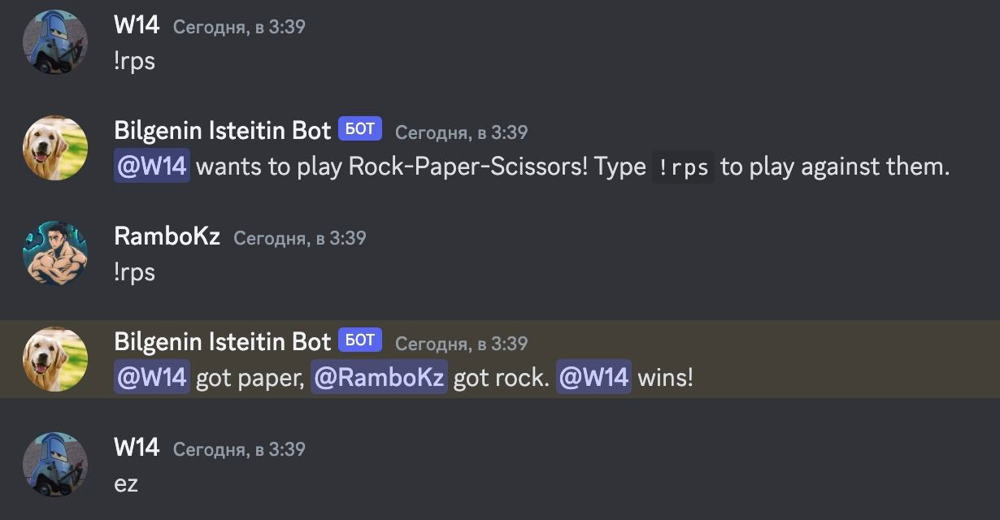
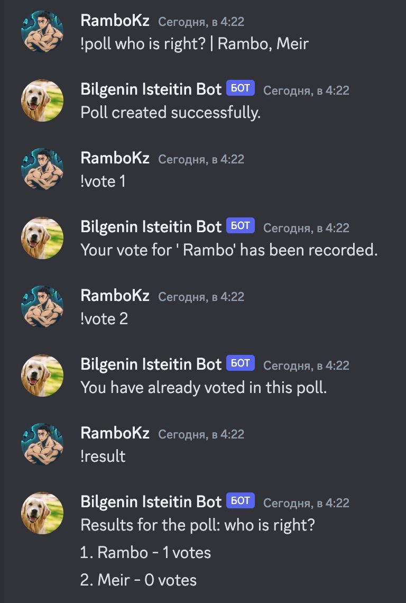
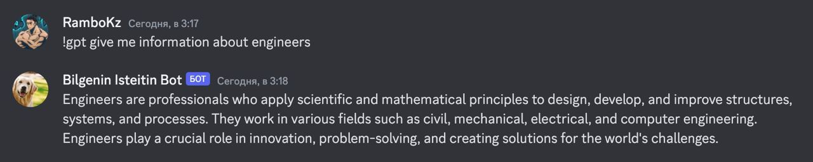
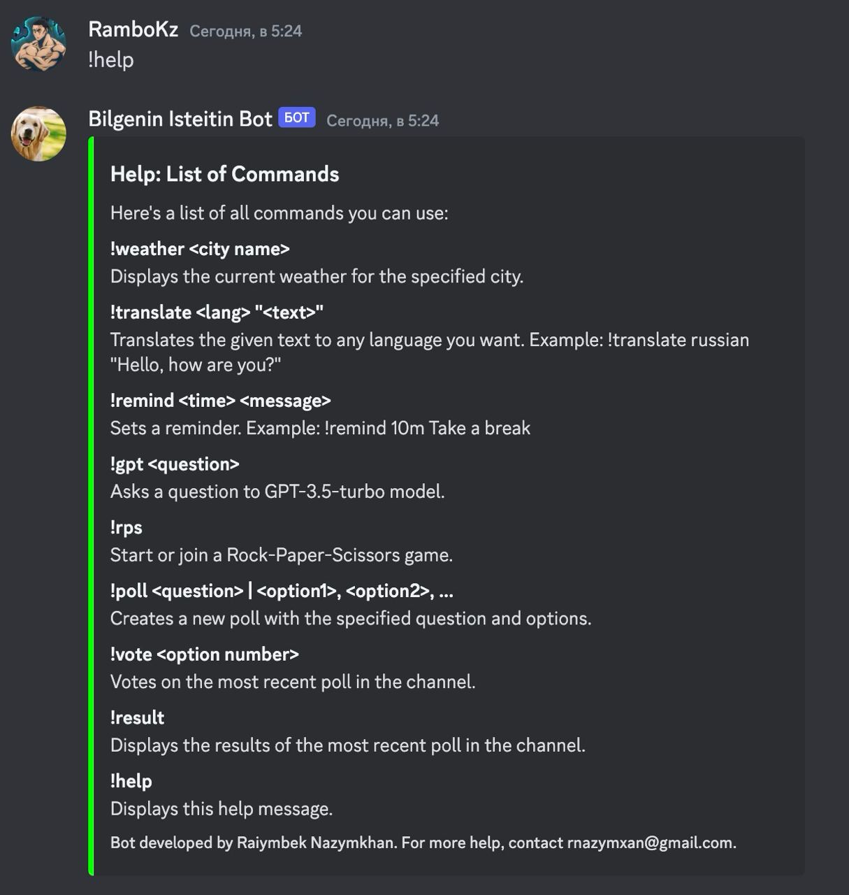

# BilgeninIsteitinBot

BilgeninIsteitinBot is a multifunctional Discord bot designed to enhance your server's interactivity and provide users with a wide range of features, from weather forecasts and language translations to setting reminders, playing games, creating polls, and engaging with AI for creative responses.

## Features

### Live Weather Updates

Get current weather information for any location directly in your Discord server.

### Language Translation

Easily translate text between languages to facilitate communication within your community.

### Reminders

Set custom reminders to keep track of important tasks and events.

### Rock-Paper-Scissors Game

Challenge friends to a quick game of rock-paper-scissors.

### Polls and Voting

Create polls with custom options for your community to vote on.

### Creative GPT-3.5 Interactions

Ask questions or prompt discussions with responses generated by GPT-3.5.

### Helper

Displays this help message that lists all commands.

## Usage

Here are some of the commands you can use with BilgeninIsteitinBot:

- `!weather <city name>`: Displays the current weather.
- `!translate <text>`: Translates the given text to English.
- `!remind <time> <message>`: Sets a reminder.
- `!rps`: Initiates a Rock-Paper-Scissors game.
- `!poll <question> | <option1>, <option2>, ...`: Creates a poll.
- `!vote <option number>`: Votes on the most recent poll.
- `!result`: Displays poll results.
- `!help`: Lists all commands.

## License

Distributed under the MIT License. See `LICENSE` for more information.

## Acknowledgements

- OpenWeatherMap API
- OpenAI API
- DiscordGo
- And all the other libraries and APIs that make this bot possible.

---

_Bring fun, utility, and AI-powered interactions to your Discord server with BilgeninIsteitinBot!_
